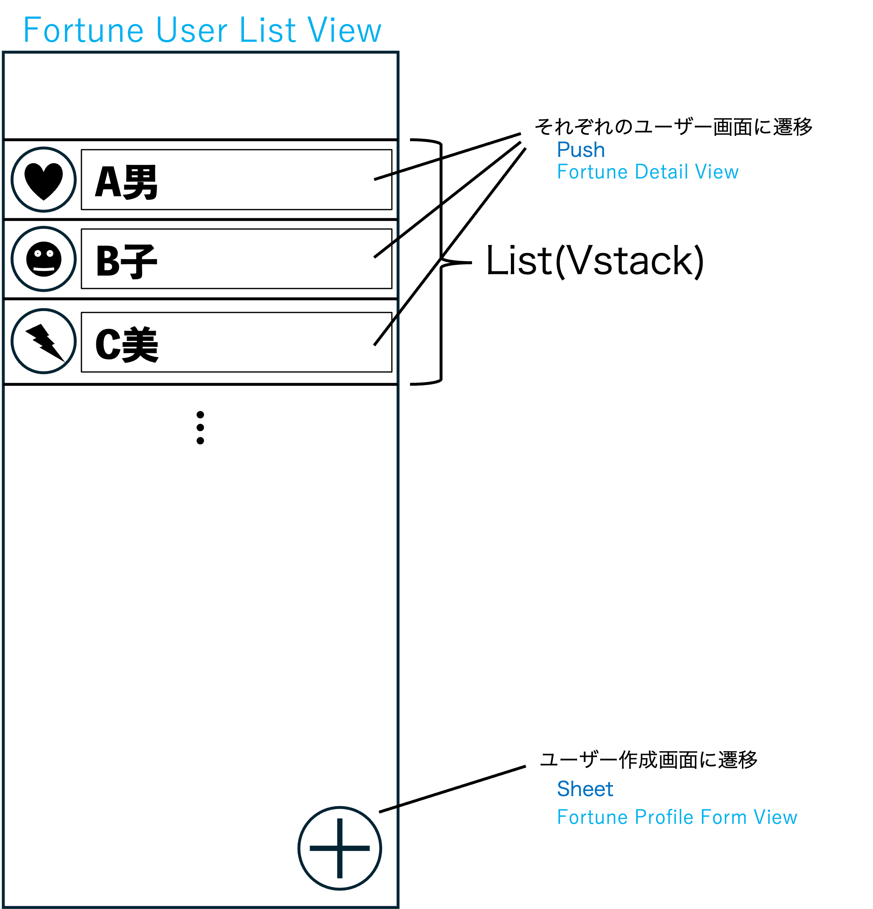
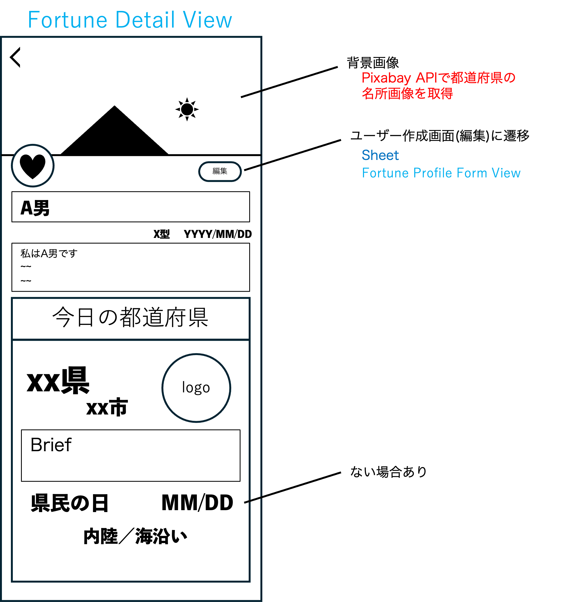
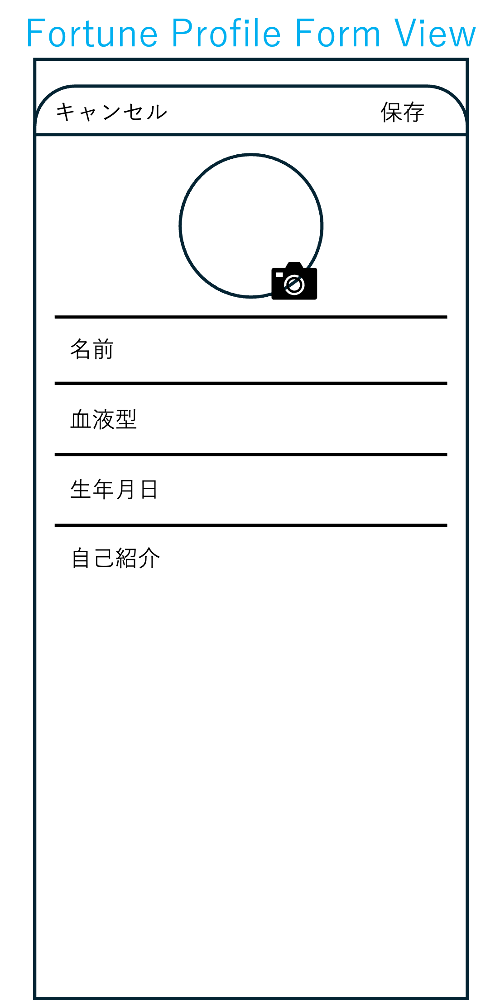

## 1. 採用技術とアーキテクチャ
- パターン: MVVM (Model-View-ViewModel)
- UI: SwiftUI(必要に応じてUIKit)
- データ管理: SwiftData
- テスト: SwiftTest

### なぜこの技術を選んだか

- **SwiftUI**: 今までの個人開発ではUIKitを使用していましたがアプリに必要な機能と開発期間を鑑みて新しいフレームワークを用いても良いなと感じたからです。SwiftUIを用いる以下の利点からも使おうと思った理由です。
    - Appleが推奨する宣言的なUIフレームワークであるから
    - 少ないコードで直感的かつインタラクティブなUIを構築できる
    - リアルタイムプレビューにより開発効率が高いから
- **SwiftData**: 課題の歓迎要件である「占い結果のローカル保存」を実装するために採用しました。今までの個人開発ではCoredataを使ってましたがSwiftDataを用いる以下の利点からも使おうと思った理由です。
    - SwiftUIとシームレスに連携するように設計されているため
    - 自動でデータが永続化されるため宣言が簡潔なため
    - 今回の規模・保存するであろう内容においてCoredataはコード量の負担が大きいと感じたため
- **Swift Testing**: アプリの品質を担保し、ロジックの正当性を証明するために導入しました。XCTestではなくSwift Testingを用いる以下の利点からも使おうと思った理由です。
    - 並列して実行するため途中でテストが失敗しても最後まで実行される
    - 宣言が簡潔で直感的

全体的に開発の効率化のために新しいSwift用のフレームワークを用いてみることを意識しました。

---

## 2. MVVM 各層の役割
### 2.1 Model
#### **永続化モデル (`@Model`)**
`SwiftData`によって永続化されるモデルです。

##### **UserProfile**
ユーザーのプロフィール情報を表現します。
- **プロパティ:**
    - `id`: `UUID` - ユーザーを一意に識別するためのID。`@Attribute(.unique)`でidが被るのを防ぐ(天文学的確率ですが一応)
    - `name`: `String` - ユーザー名。
    - `birthday`: `Date` - 生年月日。
    - `bloodType`: `BloodType` - 血液型。`A`, `B`, `O`, `AB` のいずれかを持つ列挙型として定義します。
    - `introduction`: `String?` - 自己紹介文。書くのは任意なため`Optinal`に。
    - `icon`: `Data?` - ユーザーアイコンの画像データ。設定は任意。
    - `fortuneResult`: `FortuneResult` - 占い結果。日々更新されるためデータは永続化しない。そのため`@Transient`に。

#### **データ転送モデル (DTO)**
APIとの通信など、データの転送に特化したモデルです。これらは永続化されません。

##### **FortuneRequestDTO**
占いAPIへのリクエストに使用します。
- **プロパティ:**
    - `name`: `String`
    - `birthday`: `Date`
    - `bloodType`: `String`
    - `today`: `Date`

##### **FortuneResult**
占いAPIからのレスポンスのルート要素です。
- **プロパティ:**
    - `prefecture`: `Prefecture` - 占いの結果である都道府県情報。

##### **Prefecture**
都道府県の詳細情報を表現します。
- **プロパティ:**
    - `name`: `String` - 都道府県名。
    - `capital`: `String` - 県庁所在地。
    - `citizenDay`: `MonthDay?` - 県民の日。月と日を保持します。APIからのレスポンスに存在しない場合があるため、`Optional`として扱います。
    - `logoUrl`: `URL` - 県のロゴ画像のURL。
    - `brief`: `String` - 都道府県の概要。
    - `hasCoastLine`: `Bool` - 海岸線の有無。

##### **MonthDay**
月と日を表現します。
- **プロパティ:**
    - `month`: `Int` - 月
    - `day`: `Int` - 日

### 2.2 View
#### **FortuneUserListView**
ユーザーの一覧を表示するメイン画面。

- **主な責務・機能:**
    - `@Query` を使用して `UserProfile` のリストをSwiftDataから直接取得し、リスト表示する。
    - 各行にはユーザーアイコンと名前を表示する。
    - 各行をタップすると、`FortuneDetailView` へナビゲーションする。
    - ナビゲーションバーの「+」ボタンをタップすると、`FortuneProfileFormView` をシートとして表示しユーザー作成画面に遷移する。
- **主要なUIコンポーネント:**
    - `NavigationStack`
    - `List` (or `ForEach`)
    - `NavigationLink`
- **図:** 

#### **FortuneDetailView**
選択したユーザーの詳細と占い結果を表示する画面。

- **主な責務・機能:**
    - `FortuneDetailViewModel` から受け取ったユーザー情報（名前、自己紹介など）を表示する。
    - `ViewModel` から受け取った占い結果（都道府県名、概要など）を表示する。
    - `ViewModel` から受け取った都道府県のロゴ画像を表示する。
    - `ViewModel` の `isLoading` 状態に応じて、プログレスインジケーター（`ProgressView`）を表示する。
    - ナビゲーションバーの「編集」ボタンをタップすると、`FortuneProfileFormView` をシートとして表示する。
- **主要なUIコンポーネント:**
    - `VStack`, `HStack`, `ScrollView`
    - `Image`, `Text`
    - `ProgressView`
- **図:** 

#### **FortuneProfileFormView**
ユーザーのプロフィールを新規作成または編集する画面。

- **主な責務・機能:**
    - `FortuneProfileFormViewModel` の状態（`name`, `birthday`など）とフォームの各入力フィールドをバインディングする。
    - `TextField` で名前と自己紹介を入力する。
    - `DatePicker` で生年月日を選択する。
    - `Picker` で血液型を選択する。
    - `PhotosPicker` を使用して、ユーザーアイコン画像を選択・設定する。
    - 「保存」ボタンと「キャンセル」ボタンを配置する。
- **主要なUIコンポーネント:**
    - `Form`
    - `TextField`, `DatePicker`, `Picker`
    - `PhotosPicker`
    - `Button`
- **図:** 

### 2.3 ViewModel
#### **FortuneUserListViewModel**
必要ないため作成しない
#### **FortuneDetailViewModel**
ユーザー詳細画面（`FortuneDetailView`）のためのViewModel。

- **責務:**
    - 選択された `UserProfile` に基づき、`FortuneRequestDTO` を作成して占いAPIへリクエストを実行する。
    - 結果を `user.fortuneResult` プロパティ（`@Transient`）に格納する。
    - `ImageService` を使い、`logoUrl` から**ロゴ画像**を非同期で取得する。
    - `ImageService` を使い、`prefecture.name` でPixabay APIから**ヘッダー画像**を非同期で取得する。
    - APIリクエストや画像取得中のロード状態やエラー状態を管理する。
- **状態（プロパティ）:**
    - `user`: `UserProfile` - 表示対象のユーザー。
    - `logoImage`: `UIImage?` - 都道府県のロゴ画像。
    - `headerImage`: `UIImage?` - ヘッダー用の風景画像など。
    - `isLoading`: `Bool` - データ取得中の状態。

#### **FortuneProfileFormViewModel**
プロフィール作成・編集画面（`FortuneProfileFormView`）のためのViewModel。

- **責務:**
    - ユーザー情報の入力値（名前、誕生日、血液型など）を保持・検証（バリデーション）する。
    - ユーザーアイコン画像の選択を管理する。
    - 既存ユーザーの編集時は、初期値を設定する。
    - 保存処理を実行し、`UserProfile` を作成または更新する。
- **状態（プロパティ）:**
    - `name`: `String`
    - `birthday`: `Date`
    - `bloodType`: `BloodType`
    - `introduction`: `String?`
    - `icon`: `Data?`
    - `isEditing`: `Bool` - 新規作成モードか編集モードかを判定。

---

## 3. API サービス設計

APIとの通信は、「2.1 Model」で定義されたDTO (Data Transfer Object) を介して行います。

- **FortuneAPIService**: `/my_fortune` (POST)
  - **リクエスト:** `FortuneRequestDTO` をJSONとして送信します。
  - **レスポンス:** レスポンスのJSONは `FortuneResult` DTOとしてデコードします。

- **ImageService**
  - `fetchImageData(from url: URL)`: 指定されたURLから画像データを非同期で取得する。
  - `searchImageData(for query: String)`: 指定されたクエリでPixabay APIを検索し、画像データを返す。規約を遵守するため、URLではなく画像データそのものを扱う。
    - PixabayAPIは[Pixabay API 公式ドキュメント](https://pixabay.com/api/docs/)を参考にする。
    - 具体的な送信するJSONは実際に返される画像を見て調整する。
  - 取得した画像データは `NSCache` を用いてメモリにキャッシュする。

---

## 4. データフロー

主要な機能における、データと処理の流れを以下に示します。

#### **1. ユーザーリストの表示と削除**

`FortuneUserListView` (View)
- `① @Query` を通じて `SwiftData` から `UserProfile` のリストを直接取得・表示。

#### **2. 占い結果の表示**

`FortuneUserListView` (View)
- `① ユーザーが特定のユーザーをタップ`
↓
`FortuneDetailView` (View)
- `② 表示されると同時に、ViewModel の関数を呼び出す`
↓
`FortuneDetailViewModel` (ViewModel)
- `③ 受け取った UserProfile から FortuneRequestDTO を作成`
- `④ FortuneAPIService にリクエストを送信`
↓
`FortuneAPIService` (Service)
- `⑤ APIサーバーと通信`
- `⑥ 結果を FortuneResult DTO として ViewModel に返す`
↓
`FortuneDetailViewModel` (ViewModel)
- `⑦ 受け取った結果を UserProfile の @Transient プロパティに格納`
- `⑧ ImageService を使ってロゴ画像やヘッダー画像を取得`
- `⑨ 取得したデータやロード状態を @Published プロパティで公開`
↓
`FortuneDetailView` (View)
- `⑩ ViewModel の状態を監視し、UIを更新`

#### **3. プロフィールの新規作成・編集**

`FortuneUserListView` or `FortuneDetailView` (View)
- `① 「+」または「編集」ボタンをタップ`
↓
`FortuneProfileFormView` (View)
- `② フォームが表示され、ユーザーが情報を入力`
- `③ 入力値は ViewModel の @Published プロパティにバインドされる`
- `④ ユーザーが「保存」をタップ`
↓
`FortuneProfileFormViewModel` (ViewModel)
- `⑤ 入力値のバリデーションを実行`
- `⑥ 新規作成または既存の UserProfile を更新`
- `⑦ SwiftData に変更内容を保存`
↓
`SwiftData`
- `⑧ データを永続化`
↓
`FortuneUserListView` (View)
- `⑨ @Query が変更を検知し、リストのUIを自動で更新`

---

## 5. 今後の拡張

以下、コア機能が完成し、余力があれば実装する機能です。

#### **1. ユーザー体験の深化**

-   **初回ユーザーのナビゲーション**
    -   **目的:** 新規ユーザーがアプリの主要な機能（プロフィールの作成、占いの実行など）を迷わず使えるようにし、満足度を高めるため。
    -   **アプローチ案:** アプリ初回起動時のみ、操作を促す吹き出しやハイライトを表示する。`AppStorage` などで初回起動フラグを管理する。

-   **全国制覇マップ**
    -   **目的:** ユーザーに継続的な利用目標を与え、コレクションする楽しみを提供する。
    -   **アプローチ案:** 占いで出た都道府県を日本地図上でハイライトしていく。制覇率に応じて称号などを付与する。

-   **占い結果のシェア機能**
    -   **目的:** SNSでの拡散（バイラル）を促し、新規ユーザー獲得につなげる。
    -   **アプローチ案:** 占い結果をカード風の画像として生成し、SNSに簡単に投稿できるようにする。

#### **2. 実用的な価値の向上**

-   **移住支援情報の表示**
    -   **目的:** 占い結果に「移住」という実用的な付加価値を与え、ユーザーの興味を深めるため。
    -   **アプローチ案:** 各自治体が提供している移住支援情報のWebサイトへリンクする。あるいは、もしそのような情報を集約したAPIが存在すれば、それを活用する。

#### **3. ソーシャル機能の強化**

-   **同じ占い結果のユーザーとのマッチング機能**
    -   **目的:** 「占い」という共通点でユーザー同士のつながりを生み出し、アプリの継続利用を促進するため。
    -   **アプローチ案:** Firebaseやカスタムバックエンドを構築し、ユーザー認証、プロフィール管理、チャット機能などを実装する。大規模な追加開発となる。そのため今回実装するなら架空のユーザーを複数作成してそこを仮想サーバーと見立てる。

---

## 6. 開発計画（ブランチ戦略）

本プロジェクトはGit Flowをベースとしたブランチ戦略を採用する。
`develop`ブランチから、機能単位で`feature`ブランチを作成して開発を進める。

### 詳細な作業ブランチ計画

#### **Phase 1: 基盤整備**
*(このフェーズは、他のすべての機能の基礎となります)*

-   **`feature/setup-project`**
    -   [x] Xcodeプロジェクトの初期設定
    -   [x] アプリアイコン、アクセントカラーなどのアセット設定
    -   [x] ~~SwiftLintの導入と設定~~(デフォルトのツールを使うことに)
-   **`feature/implement-models`**
    -   [x] `BloodType.swift`, `DTOs.swift`, `UserProfile.swift`を作成
    -   [x] `SwiftData`のコンテナ設定
    -   [x] **UnitTest:** モデルの初期化やロジック（もしあれば）を検証

#### **Phase 2: API通信層**
*(モデル定義に依存し、UI層から利用されます)*

-   **`feature/api-fortune-client`**
    -   [x] `FortuneAPIService`を実装
    -   [x] **UnitTest:** モックを使ったAPIクライアントのテスト
-   **`feature/api-image-client`**
    -   [x] `ImageService`の画像取得・検索部分を実装
    -   [ ] **UnitTest:** モックを使った画像取得処理のテスト
-   **`feature/api-caching`**
    -   [x] `ImageService`にキャッシュ機構を実装
    -   [ ] **UnitTest:** キャッシュの追加・取得・削除ロジックを検証
-   **`feature/api-error-handling`**
    -   [x] `APIError` enumなど、カスタムエラー型を定義
    -   [x] 各APIサービスクラスにエラーハンドリングを組み込む

#### **Phase 3: プロフィール作成・編集機能**
*(API層やモデルに依存します)*

-   **`feature/profile-form-viewmodel`**
    -   [x] `FortuneProfileFormViewModel`のロジックを実装
    -   [x] **UnitTest:** バリデーションや保存ロジックを検証
-   **`feature/profile-form-ui`**
    -   [x] `FortuneProfileFormView`のUIを構築
    -   [x] ViewModelとUIをバインディング
    -   [x] **UITest:** プロフィールが正常に作成・編集できるか一連の流れをテスト

#### **Phase 4: ユーザーリスト機能**
*(モデル定義に依存します)*

-   **`feature/user-list-ui`**
    -   [x] `FortuneUserListView`のUIを構築
    -   [x] `@Query`を用いたリスト表示を実装
-   **`feature/user-list-actions`**
    -   [ ] 詳細画面への遷移、削除機能を実装
    -   [ ] **UITest:** 画面遷移、ユーザー削除が正しく動作するかテスト

#### **Phase 5: 占い詳細機能**
*(すべての機能に依存します)*

-   **`feature/fortune-detail-viewmodel`**
    -   [x] `FortuneDetailViewModel`のロジックを実装
    -   [x] **UnitTest:** 占い実行や状態遷移のロジックを検証
-   **`feature/fortune-detail-ui`**
    -   [ ] `FortuneDetailView`のUIを構築
    -   [ ] ViewModelとUIをバインディング
    -   [ ] **UITest:** 占い結果が正しく表示されるか、ローディング表示が機能するかテスト