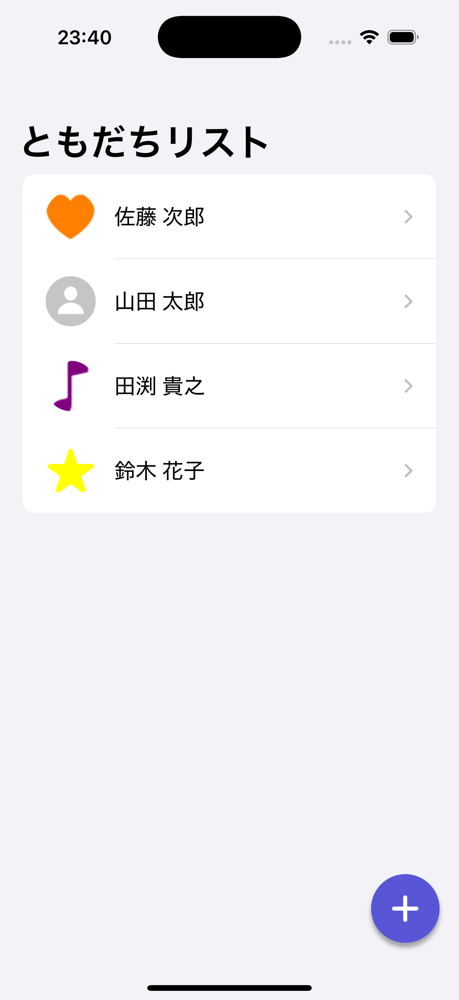
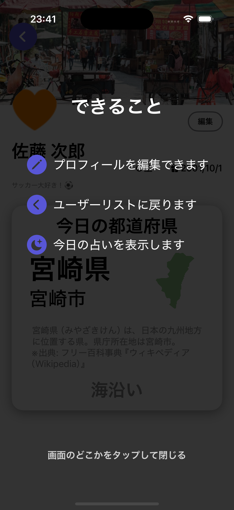
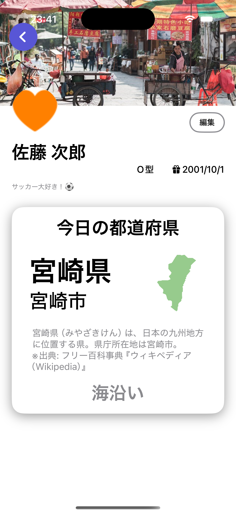
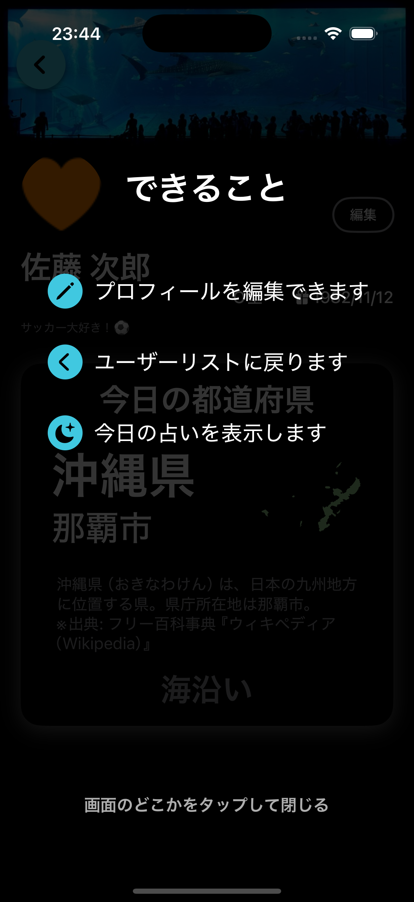
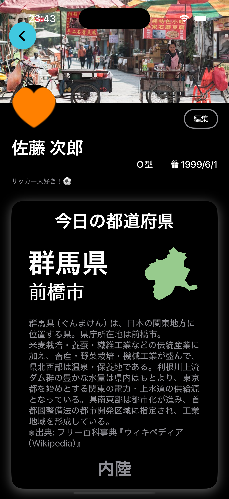

# 都道府県相性占いアプリ


## 概要

株式会社ゆめみ様の「iOS 未経験者エンジニア向けコードチェック課題」で作成した、あなたと相性のいい都道府県を占うiOSアプリです。

## ⚠️ 注意
**このアプリではPixabayAPIを使っています。**
APIキーは以下のように追加してください。
**追加しなくても動作自体はします。**
1. ルートディレクトリに以下のファイルを追加
```
touch Secrets.xcconfig
```
2. 空の`Secrets.xcconfig`に以下の行を追加
```
PIXABAY_API_KEY=${あなたのAPIキーをここに追加}
```
**`""`で囲まないでください**

## 📷 スクリーンショット

### ライトモード

| ユーザーリスト(ユーザー不在時) | ユーザーリスト(ユーザー実在時) | ユーザー作成 | チュートリアル | ユーザー画面 |
| :---: | :---: | :---: | :---: | :---: |
|  |  |  |  |  |

---

### ダークモード

| ユーザーリスト(ユーザー不在時) | ユーザーリスト(ユーザー実在時) | ユーザー作成 | チュートリアル | ユーザー画面 |
| :---: | :---: | :---: | :---: | :---: |
|  |  |  |  |  |
## 💻 インストール・実行方法

1. Xcode 16.4 で `PrefectureCompatibilityApp.xcodeproj` を開く
3. Cmd + R でビルド＆実行

## 🛠️ 技術スタック・アーキテクチャ

本プロジェクトでは、以下の技術を採用しています。

| 領域 | 技術 |
| :--- | :--- |
| UIフレームワーク | SwiftUI |
| データ永続化 | SwiftData |
| テスト | Swift Testing |

## ⚙️ 動作環境（ターゲット）

- **Minimum Deployment**: iOS 18.5
- **Xcode Version**: 16.4
- **Swift Version**: 5.10

---

## 生成AIの利活用

本プロジェクトでは、開発効率と品質の向上を目的として、一部のプロセスにおいて生成AIを活用しています。

### 利用する主な生成AI

-   Gemini CLI (2.5 pro)

### 主な活用場面

-   **設計・アイデア出し:**
    -   アーキテクチャの壁打ちや、新機能のアイデアに関するブレインストーミング。ブランチ戦略やブランチ名やコミットメッセージの命名規則の統一。
-   **ドキュメンテーション:**
    -   README、DESIGNの構成案作成、文章の清書。
-   **ユニットテスト**
    -   ユニットテストの生成。生成されたコードを読み適切なテストかを判断するだけでよくなりテストの書く効率が向上

## 📝 開発を通じて得たこと

- SwiftUI + SwiftData を用いた iOS アプリ開発の設計・実装経験
    - それに伴い公式ドキュメントを読むことへの耐性
- API 通信の実装方法
- 生成AIを活用してユニットテストやドキュメント作成の効率を向上
- 最初に設計書を書きそれに沿って開発することの安心感
    - 仕様書の重要性
## 🚀 今後の改善ポイント

現在のバージョンは占いの結果として都道府県を表示する基本的な機能に留まっています。
今後の展望として占い結果をより実用的で魅力的な情報に昇華させるための機能拡張を検討しています。

### 機能案: 「暮らす」視点での都道府県情報拡充

占いで表示された都道府県への移住や旅行を具体的にイメージできるよう、政府統計のポータルサイト **[e-Stat](https://www.e-stat.go.jp/)** のAPIを活用し、以下の客観的なデータを表示する機能を追加します。
#### 効果
占いという気軽にできるアプリの特性上これを機に地方について知ってもらうことで地方活性化に繋げられると考えました。
#### 具体的な情報
##### 1. 生活基盤 💰
移住後の生活を具体的にイメージするための基本的なデータを提供します。
-   **人口・世帯構成:** 地域の活気や家族構成の特色を把握できます。（国勢調査）
-   **住環境:** 家賃相場や持ち家率から、住まいのコスト感を伝えます。（住宅・土地統計調査）
-   **物価水準:** 地域別消費者物価指数を用いて、都市部との生活費の違いを示します。（小売物価統計調査）

##### 2. 仕事・雇用 💼
移住の重要な要素である仕事探しに役立つデータを提供します。
-   **雇用状況:** 完全失業率や産業別就業者数から、地域の経済や盛んな産業を把握できます。（国勢調査 / 労働力調査）
-   **所得水準:** 都道府県別の平均賃金から、収入の目安を提示します。（賃金構造基本統計調査）

##### 3. 子育て・教育環境 👨‍👩‍👧‍👦
特にファミリー層にとって重要な判断材料となるデータを提供します。
-   **子育て環境:** 保育所数や待機児童数、共働き世帯の割合などから、子育てのしやすさを伝えます。（社会生活基本調査 / 各自治体オープンデータ）
-   **教育機関:** 幼稚園から高等学校までの学校数など、教育環境の充実度を示します。（学校基本調査）

